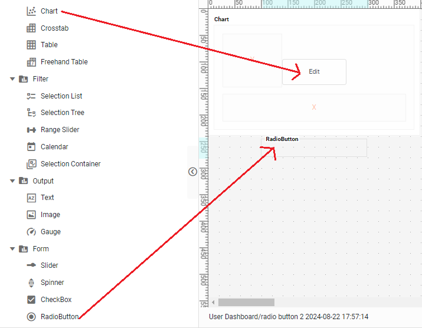
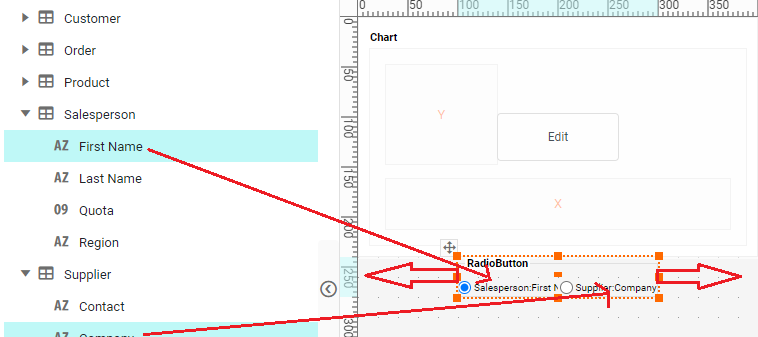
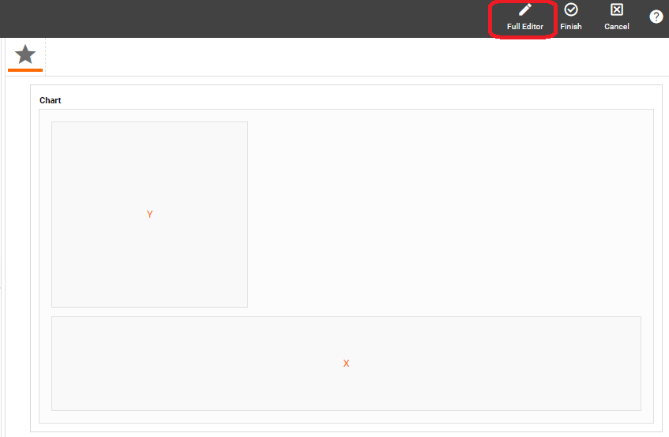
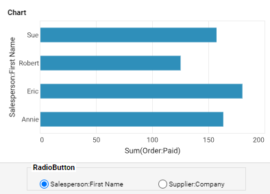
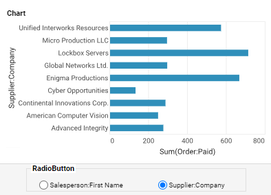

# How do I make a chart that switches data bindings back and forth?

This example uses the orders dataset. Drag out a chart and radio button from the left hand panel.

Select the radio button so it is highlighed in orange as shown. Drag out dimensions 'Salesperson:First Name' and 'Customer:Company' into the radio button. Click on the orange squares on either side of the highlighed radio button to stretch the element to a width necessary to show it's labels.

Click on the 'Edit' button in the center of the chart. If the Visualization Reccomender appears, select 'Full Editor'.

In full Chart Editor, drag 'Order:Paid' into the x axis. It should default as a sum.

Drag 'Salesperson:First Name' into the y axis.

Click on the button with an F and X on it next to where 'Salesperson:First Name' was dragged into the y axis. Select 'Variable' in the dropdown that appears. The space for the y axis should now display '$(Radiobutton1)' or whatever name you gave the radio button. 

Click 'Finish'. You now have a chart that defaults as orders by salesperson.

Click the radio button for 'Supplier:Company' and watch the chart switch to displaying orders by supplier.

