# How do I recreate my Excel report with InetSoft's tool?

This document contains instructions on how to recreate your Excel report using InetSoft's Style Intelligence. It covers the most common usage needs for table style reports.

[How do I combine multiple pivot tables into one table?](#pivot)

[How do I include multiple lists in the same table?](#lists)

[How do I group table columns under subheaders??](#sub)

# How do I combine multiple pivot tables into one table? 

 

This   [multilevel freehand table example](https://www.inetsoft.com/public/app/viewer/view/global/Dashboards/Return%20Analysis%20Table)   uses the Orders Details dataset. This table displays the information that would require three separate pivot tables if made in excel. Scroll sideways to see the three tables displayed as one. This table that combines pivot tables displaying orders by month broken down by team and salesperson, product category and product, and company.

  

Begin by dragging out a freehand table element and selecting 'Edit'.

Then right click on a cell and click 'Insert Row'. 

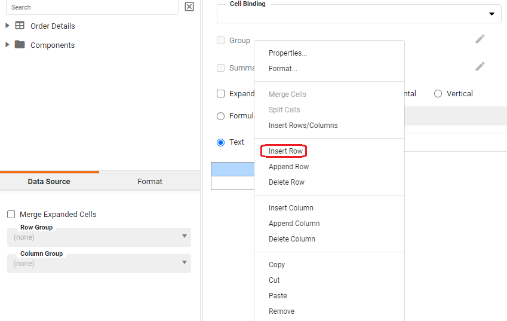

Right click on a cell again and select 'Insert Rows/Columns'.

Insert 3 extra columns, after the selection.

Drag out dimension 'Order Date' into the bottom left cell. 

Select the cell containing 'Order Date', and set group to the 'Month' level. Set 'Expand Cell' to 'Vertical'.

Add dimensions 'Sales Team' and 'Sales Rep' to the cells where they are pictured below.

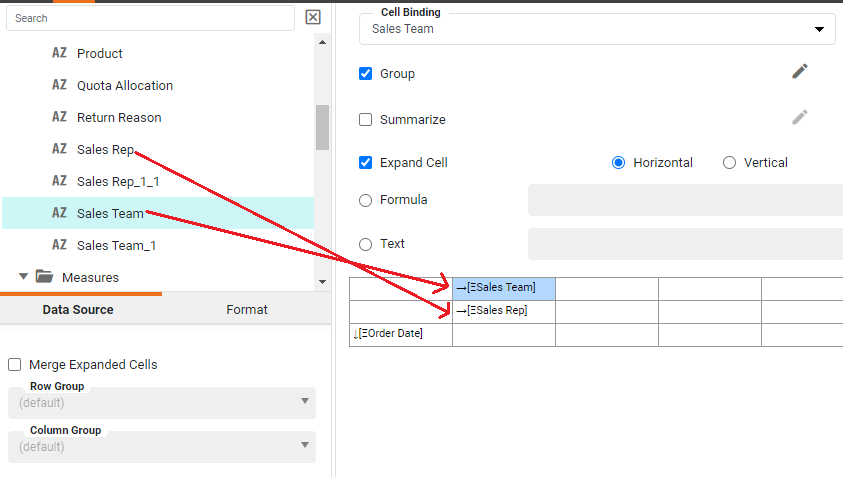

Make sure that on 'Sales Team', and 'Sales Rep', expand is set to 'Horizontal'.

Add 'Gross Amount' to the bottom cell of the second column.

Next, move dimensions 'Category' and 'Product' into the first two cells of the third column. Make sure expand on both is set to Horizontal.

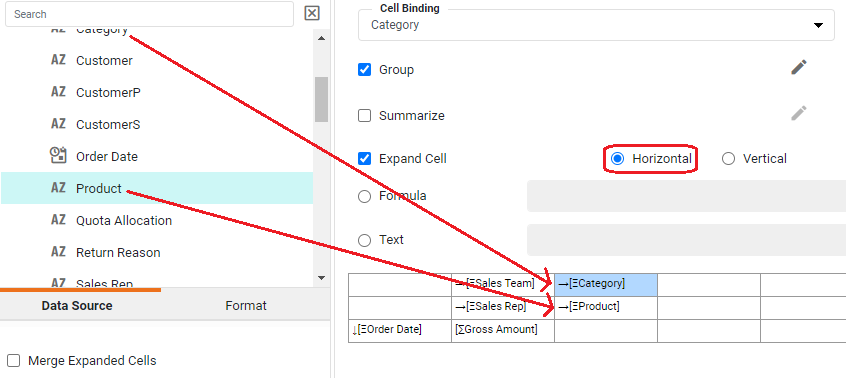

Drag 'Gross Amount' into the bottom cell of the third column.

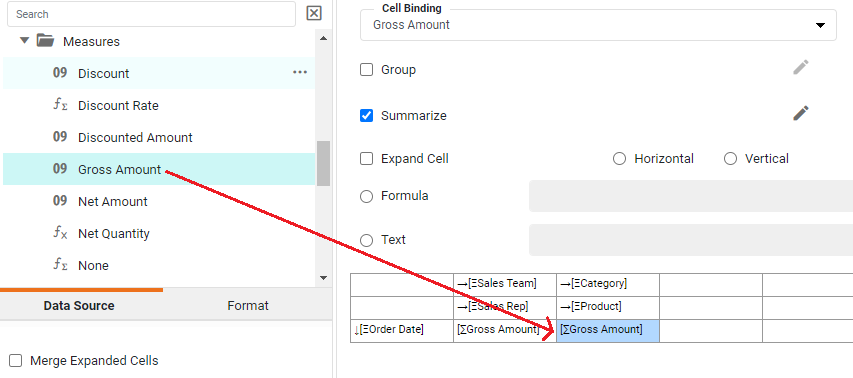

Select the top two blank cells on the right. Right click  and select 'Merge Cells'.

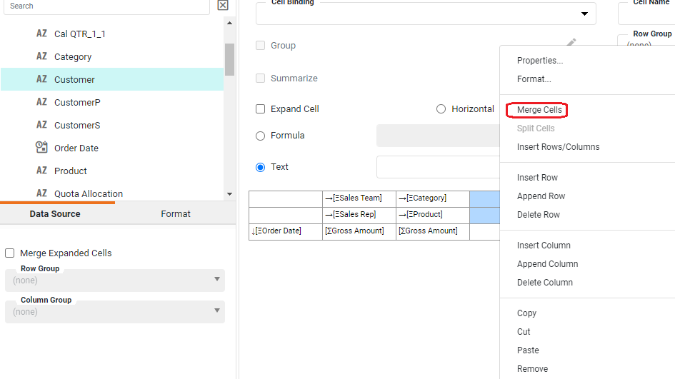

Drag 'Customer' dimension into the merged cells. Make sure it is set on Horizontal.

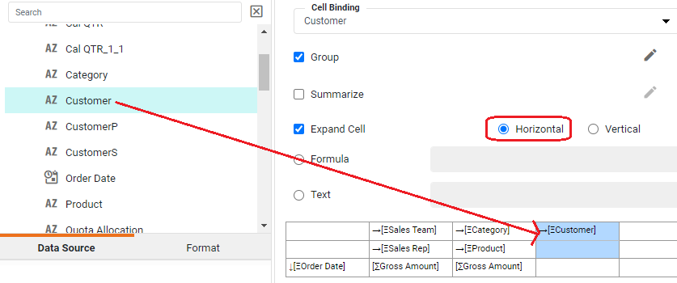

Drag 'Gross Amount' measure into the bottom right cell.

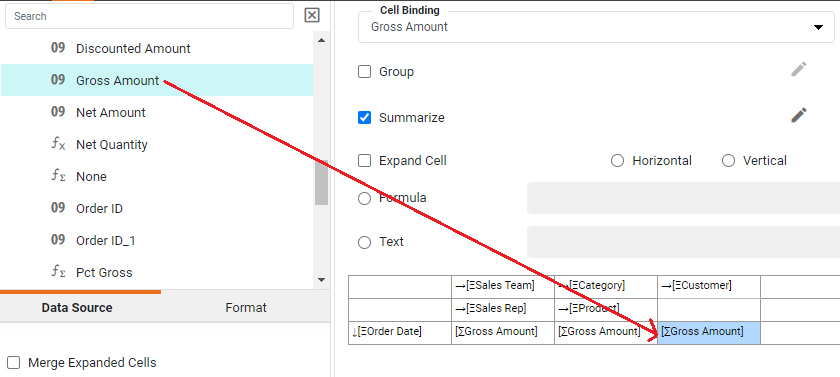

Click 'Finish'. You now have a freehand table which combines three pivot tables into one.

The table aggregates order data into rows based on month of the year. The table begins with columns for team and subcolumns for employee.

It then breaks the orders down by columns of product category and product.

It ends with columns for company.

# How do I include multiple lists in the same table? 

This example uses the Orders dataset to create combined lists of total sales and product quantities, by product category and region.

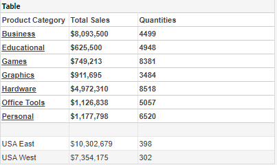

Begin by dragging out a freehand table from the left side panel. Click the edit button in the middle of the new table.

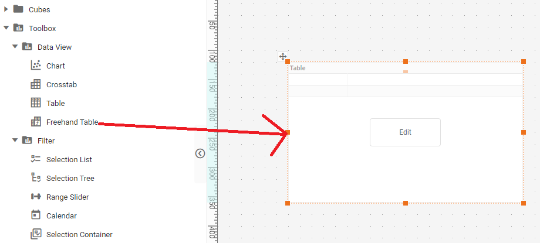

Select one of the cells in the table representation. Right click, select add column. Right click again, click add rows/columns.

Select Rows, insert number 2.

Select the top left cell. Make sure 'Text" is selected, type "Product Category" into the accompanying field and press enter.

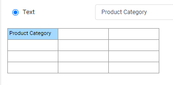

 On the left side data panel, open query 'Product" and drag dimension 'Category' into the second to top cell on the left. Make sure 'Expand Cell' is selected, and set to 'Vertical'.
 

 On the left side data panel, open query 'Customer" and drag dimension 'Region' into the bottom cell on the left. Make sure 'Expand Cell' is selected, and set to 'Vertical'.

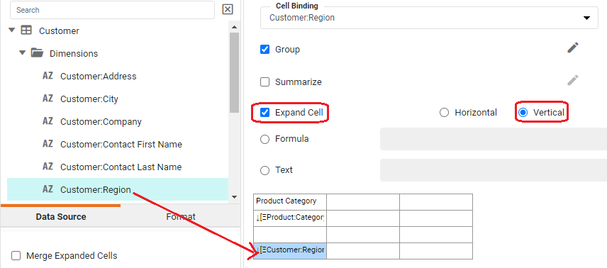

Select the cell in the top row that is second from the left. Make sure 'Text" is selected, type "Product Category" into the accompanying field and press enter.
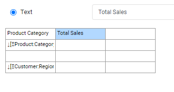
