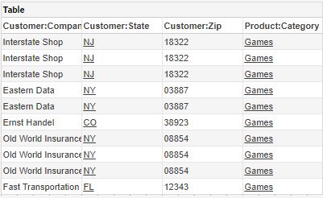
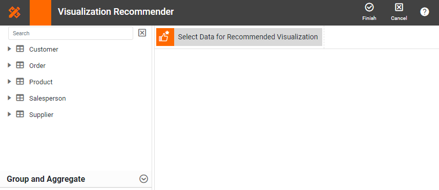
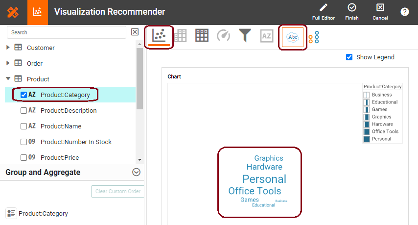
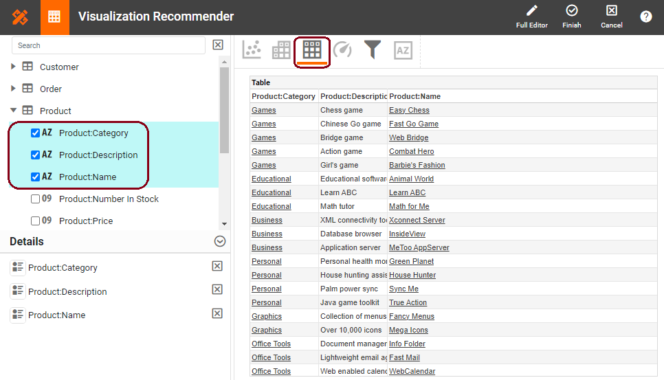

WHAT A TABLE DOES VS WHAT A CROSSTAB DOES

Should I use a table or a crosstab? This depends on whether you want to display row level data or display grouped and summarized data.

 
 
A simple flat tables does not aggregate metrics; it simply displays individual detail level rows of the columns selected, limited by dashboard filters.
A table presents a certain selected set of columns in a certain order, with no grouping or summarization, data only limited by filters.
A table consists of detail rows containing cells pertaining to selected column headers and table style, with the option to export rows.

Crosstabs are for those who want to display data in summarized way, for when detail level data is left available at the dashboard level. Crosstabs always do grouping and summarization. When creating a crosstab, you select dimensions for row grouping, select dimensions for column groupings, and select the aggregation methods for the measures you choose.A crostab's default behavior is to merge  duplicate cells into  row and column headers.

Crosstabs can include subtotals and grand totals, including subtotals for individual columns and grand total columns or rows.
Tables are for detail level transactional data.

GETTING IDEAS BY USING THE VISUALIZATION RECCOMENDER

 You can begin your search for the ideal chart oubput by making a note of what our product would assume by using InetSoft's Visualization Reccomender. This is the option that first appears when you create a dashboard. It selects an ideal dashboard output option based on which columns from the dataset are selected. 
 

  Using the reccomender wizard can help you get an idea for how to display your data. What method of displaying data does the product assume? this will vary based on whether dimensions or measures are chosen and how many of each.
 
 The first thing that the wizard Recommender considers is whether or not you're working with a dimension versus a measure. Selecting a dimension automatically results in a chart. So if you're just grabbing a simple text phrased field, it's going to automatically do a chart. 
 
 
 However, If you start introducing additional dimensions. And you get to a third dimension it may suggest a crosstab table.

Once you get to three or more dimensions the reccomender often starts reccomending a flat detail level table, as that is the common use case for several dimensions with no measures, since without measures there can't be aggregation.

 
 
Adding a measure from there switches back to a chart as it assumes an aggregated measure.

Switching to a crosstab results in the reccomender choosing a pivot style table based on fields selected and the order they were added, 
with horizontal and vertical groupings along row and column headers, with calculated values populated throughout.

WHEN DO I NEED A TABLE?
Tables maintain data at the level of detail made available by the data worksheet. If you already have grouping and aggregation built into the data source or the worksheet, a detail table may not be so detailed.

Use a detail table  to maintain data at detail level that is available at the dashboard level, the detail level is maintained as an organized set of rows and columns

If data is very pre aggregated at the data worksheet level, then there will not be very much aggregation happening in the crosstab.

WHEN DO I NEED A CROSSTAB?
Crosstabs are for when you want data to be grouped and summarized or aggregated in numerical form. They provide a potentially more detailed alternative to charts, with the potential to display many more aggregates broken down by a greater number of dimension than a chart. They are good for use cases where displaying exact humerical aggregates is vital to the dashboard display, such as when data aggregates are very close to each other numerically.

With a detail table,  "what you see is what you get".

The question is, how important is detail level data to your end users? A detail level table guarantees that detail data will be available in the dashboard's exported form.

DIFFERENT WAYS TO USE A DETAIL TABLE
Some will use a detail table with flyover, using a chart or crosstab displaying aggregates and having the detail table display detail rows of the aggregate moused over "permanent show details filtered by a chart"
A detail level table is for displaying transactional data with data driven highlights or it can be used as a flyover.
A detail table can even be hidden behind a chart to provide raw data for export only. It can also be placed in a tab behind a chart for a quick drilldown option.
They can also do a data tip view, to have a detail table appear over a data point aggregate instead of taking up space in the dashboard
Either option exports easily.

ALTERNATIVES TO DETAIL LEVEL TABLE
However the 'Show Details' feature can be used in liew of detail table.

There are other options besides a table to show detail level rows. When viewing a crosstab, users can utilize the show details feature, multiselecting desired cells and clicking 'Show Details' in the popup menu commands to  display all rows that make up the selected aggregates.

While a 'Show Details' function can be peformed on a crosstab, once the crosstab is exported, access to detail level data is lost, only the displayed aggregates are available.
 

WHAT FEATURES ARE UNIQUE IN A CROSSTAB
You cannot perform the 'Show Details' function on a detail level table as the table is already displaying the most granular level of data that is available on the dashboard level. So a crosstab still has drilldown options to see detail level.

Totals are not an option in a detail table, but once again you can use a freehand table which includes detail level data and totals. Freehand tables can include both summary and detail rows.

A crosstab supports date comparisons, while a detail level table does not.

WHAT FEATURES ARE UNIQUE IN A TABLE
table ensures that detail level data is available in a dashboard export
For this reason a detail level table is useful for data grabs.
Tables have options for sorting and options for hidden fields for dynamic highlighting across a row based off of a value in that row. Table row highlights can factor in hidden columns in their calculations, for when there are values that you'd prefer not to show but are still vital in making calculations.

On a crosstab you cannot utilize a hidden column to calculate highlights, as you can on a detail table.
On a detail table you have the option to highlight across the entire row, whereas in a crosstab individual cells are highlighted, as they are distince aggregates

WHAT FEATURS DO THEY SHARE?

Both tables and crosstabs can include hyperlinks to other dashboards, or to web pages.

Both allow highlighting with data driven formatting.

FOR BEST OF BOTH WORLDS USE FREEHAND TABLE
Crosstabs follow a format of outer grouping followed by inner grouping  followed by calculated values,  with duplicate dimension headers being merged into larger labels. If these default settings are unsatisfactory but you still want to group and aggregate data in a table format, you can display the same kinds of aggregates using a freehand table, but with much greater flexibility when it comes to formatting and layout. (See document titled "How to Recreate an Excel Report with InetSoft" for instructions on freehand tables.)

A freehand table enables you to control whether duplicate column and row headers get merged together or stay apart. Freehand tables also allow you to display detail level data alongside agregates, giving you the best of both worlds. 

With the flexibility of freehand tables, many aggregations done at the data level to be unnecessary.

CONCLUSION
The question of crosstab vs table is fundamentally a question of grouping and summation vs details. Freehand tables offer the option of a hybrid approach. Moreover, both table and crosstabs can be converted to freehand tables, so feel free to start with the one you think might meet your needs.

 

 

