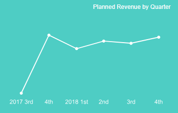

# Comparing Standard Periods

Standard periods are for when you want to compare across months, weeks, quarters, or years.

In this example of comparing standard date periods, we will use a line chart from InetSoft's construction dashboard. Let's say that you are the to executive of a construction company and you want to see which quarters have been the strongest or the weakest over the years in terms of revenue.  

We can adjust the chart to display quarters but in order to really compare the same quarter from year to year, we want different years quarter's to display next to each other for easy comparison. To begin this, we access the date comparison menu, right click on the chart and click 'Date Comparison'. Make sure you are on the 'Standard Periods' tab.

The date comparison feature automatically suggests today's date as the end of the range to be compared, but a custom end date can also be entered. Since this chart is displaying data that is a few years old, we will select 'past 10 years'. We will uncheck 'include year for end date (since we are not specifying one)  and 'beginning of each year until' for the same reason. Select compare data for 'all' and compare data by quarter. Click 'OK'.

As you can see, the line chart has automatically changed into a bar chart, with each bar representing a quarter, and different colors representing the two years displayed. Each quarter is stacked next to the same quarter for the next year, enabline easy comparison.
