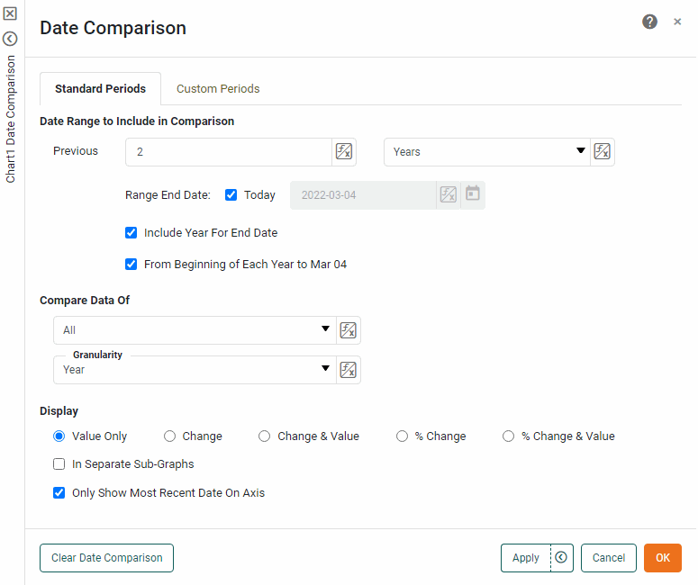
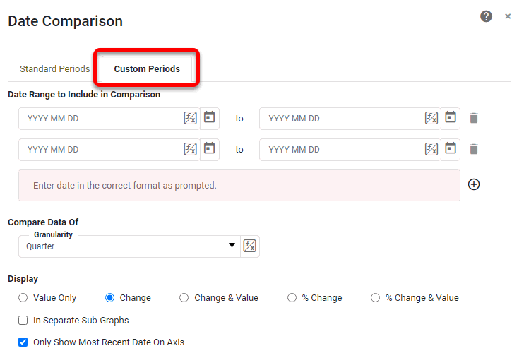

# How to use the Date Comparison Feature

What makes charts so useful in analytics is the ability for a user to visually see the proportion among different data points. However in many cases there are too many data points to give clarity. Placing relevant data points next to each other enables the user to get a much more accurate idea of their proportion. For example, when looking at a date chart, a user may prefer to see certain periods side by side for easier comparison, such as conmparing this years March earnings to last March's. Alternatively, a comparison of each month to the same month in previous years would yield insights into performance by accounting for the variables that change from month ot month in a fiscal year. InetSoft’s tool provides a way for users to compare data across various ranges side by side, such as comparing specific months, days, and years.

The tool can be accessed by end users, without visual composer access.

 To use the date comparison feature, click the … icon at the top right of a chart or table, or right click anywhere if you are dealing with a chart.
 

You can stay on the ‘standard periods’ tab if you are comparing years, quarters, months, weeks, or days.

Select the number of previous periods you want to compare, and the type of period. Select an end date for the comparison range. 

You can also select the ‘custom periods’ tab.

This menu allows you to select the start and end date of each comparison period, and select the unit of time (day, week, month, quarter, year) that you want to compare by. 
